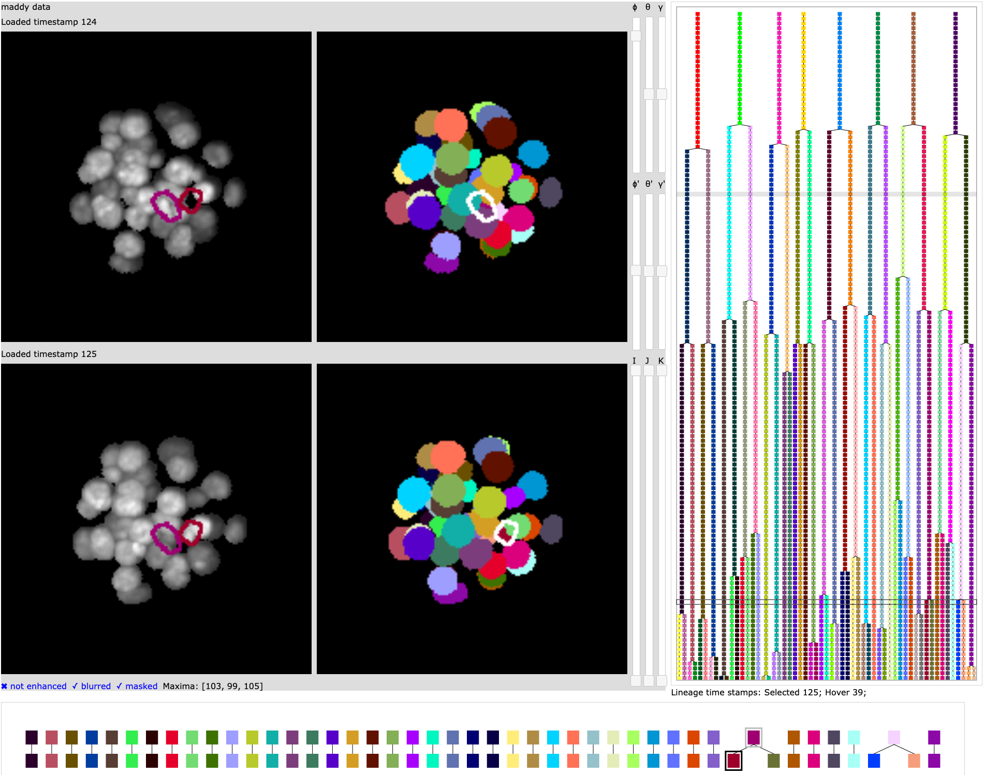
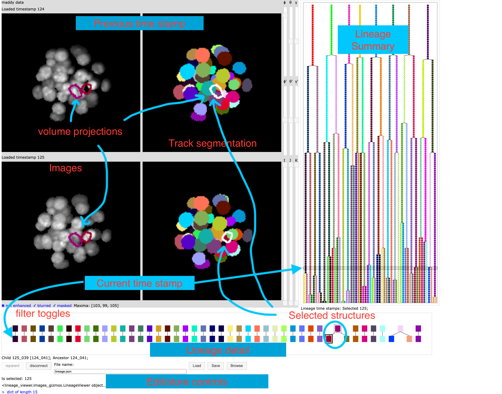

# lineage_viewer
Graphical interface for editing a lineage and viewing related microscopy images.

This package implements a graphical interface designed for use in
early embryology.  The visualization allows the user to explore the
relationship between time sequences of microscopy image volumes of an embryo, segmentation
volumes for the embryo identifying cell structures, and cell lineage trees for the
cells of the embryo.

The interface includes the ability to modify, store, and load the lineage tree.

The interface was specifically designed for use in studies of early mouse
embryology using light sheet microscopy extracted from a live embryo over many days.




# Installation

This package requires Python 3.7 or higher.  If you need to install an appropriate Python
I recommend using conda installed in single user mode (for easy maintenance) 
<a href="http://bit.ly/tryconda">http://bit.ly/tryconda</a>.

The package install procedure is not fully automated.

Please install the following dependencies manually in the following order.

```
 pip install git+https://github.com/AaronWatters/H5Gizmos
 pip install git+https://github.com/AaronWatters/jp_doodle
 pip install git+https://github.com/AaronWatters/array_gizmos
 pip install git+https://github.com/flatironinstitute/mouse_embryo_labeller
```

Then clone this repository and in the top level folder of the repository install the module in development mode as follows:

```bash
 git clone https://github.com/flatironinstitute/lineage_viewer.git
 cd lineage_viewer
 pip install -e .
```

# Starting the example lineage

The repository includes a script with some data for an example lineage
which should work "out of the box."  The sample includes a full
lineage tree description but only includes image data
for timestamps 1 and 2 of the tree.

To try the example lineage go to the `lineage_viewer/examples/lineage_sample`
directory and run the `load_sample_lineage.py` script.  

For example on my laptop:

```bash
(base) C02XD1KGJGH8:lineage_sample awatters$ cd ~/repos/lineage_viewer/
(base) C02XD1KGJGH8:lineage_viewer awatters$ cd examples/lineage_sample/
(base) C02XD1KGJGH8:lineage_sample awatters$ python load_sample_lineage.py 
Open gizmo using link (control-click / open link)

<a href="http://127.0.0.1:56998/gizmo/http/MGR_1671120997917_6/index.html" target="_blank">Click to open</a> <br> 
 GIZMO_LINK: http://127.0.0.1:56998/gizmo/http/MGR_1671120997917_6/index.html 

```
On my Mac laptop I have to confirm that Python can accept incoming connections in a pop up dialogue.

Then open the provided link URL in a browser to start the interface.
When the interface loads click on timestamp 2 near the top of the lineage tree
summary to load the images for timestamps 1 and 2 (as discussed in more detail below).


# The graphical interface

The graphical interface for the viewer displays in a web browser.
For flexibility the example scripts do not start the browser interface automatically
but instead provide a URL link so the user may choose what browser to use.  For example

```bash
(base) bash-4.4$ python load_rusty_test_data.py 
...
Open gizmo using link (control-click / open link)

<a href="http://10.128.146.57:59663/gizmo/http/MGR_1671116590930_6/index.html" target="_blank">Click to open</a> <br> 
 GIZMO_LINK: http://10.128.146.57:59663/gizmo/http/MGR_1671116590930_6/index.html 
```

The user may open the generated link `http://10.128.146.57:59663/gizmo/http/MGR_1671116590930_6/index.html`
by control-clicking the link (on a Mac OS for example).

The interface starts with no timestamp selected.  With no timestamp selected only the lineage tree summary
in the right panel displays.

Select a current time stamp by clicking on the lineage
tree summary on the right.  When a time stamp is selected the interface looks like the annotated
image below.



## Overview and motivation

This interactive interface presents the following components

- A time sequence of microscopy image stacks (volumes) of an embryo. 
- A derived timesequence of labelled volumes identifying cell structures of the embryo.
The structures can be cell nuclei, cell membrane volumes, or other structures of interest.
The "shape" of the cell volumes should match the "shape" of the microscopy volumes.
- A derived cell lineage tree which identifies the parent/child relationship for the cells
over the time sequence.
- The interface highlights a selected timestamp and the previous timestamp.
- The user can focus on a "selected structure" in the current and previous timestamp.
- The user can slice and rotate the images.

The interface is intended to allow the researcher to explore the data sets and possibly
modify the lineage tree.

The following sections discuss the components of the interface in detail:

## The Lineage tree summary

The lineage tree summary on the right side of the interface displays the lineage of
parent/child relationships among cells for the timestamps, with earlier time stamps at the
top.  Cells with no parent or child relationship are not displayed.  The user may focus
on one of the timestamps and its immediate previous timestamp by clicking the canvas.
The user can move the focus up or down using the arrow keys when the mouse if hovered over
the canvas.

## The current and previous timestamp

The interface highlights a current and previous timestamp indicated by a rectangle
on the lineage tree.  Initially there is no current timestamp and only the lineage tree
summary displays.

## The lineage timestamp detail

When the current time stamp is selected the relationship between the cells of the
current timestamp and the previous timestamp is displayed in the lineage detail at
the bottom of the interface.  All cells of both timestamps will display in the detail
view even if they don't have parent/child relationships.

The user can identify a "selected" cell for the current and previous timestamps by clicking
the rectangles that correspond to that cell.  The selections will be highlighted by outer rectangles.

## The microscopy volumes

The images on the left side display maximal value projections of the
source microscopy images.  The volume for the current timestamp appears
at the bottom and the volume for the previous timestamp appears at the top.

Outlines of selected cell structures are projected
in the images even if they are obscured behind other structures.

## The image filter toggles

Filter toggles below the microscopy images control whether the microscopy images are filtered.
Click the controls to turn them on and off.

- The "mask" toggle enables masking of the images so that regions that are not labelled
show as black background.
- The "blur" toggle controls whether background noise is "averaged out" and the
dynamic range of values is stretched.
- The "enhance" control increases the image contrast.

## The segmentation structure volumes

The colored images to the right of the microscopy images show segmentation volumes
extruded to 2 dimensions.  The volume for the current timestamp appears
at the bottom and the volume for the previous timestamp appears at the top.
The labelled volumes are colored to match the corresponding entry in the lineage tree.
Any labelled volumes that do not correspond to a node of the
lineage tree show as gray.

Outlines of selected cell structures are projected
in the image in white even if they are obscured behind other structures.
The user can select a structure by clicking the corresponding colored region.

## The rotation sliders

The microscopy and labelled volumes can be rotated using the rotation sliders to
the right of the image area.

- Sliders "ϕ", "θ", "γ" apply rotations to all image volumes.
- Sliders "ϕ'", "θ'", "γ'" apply rotations to only the current timestamp volumes.

## The slicing sliders

Slicing range sliders appear to the right of the images below the rotation sliders.
These sliders apply slicing in the I, J, and K dimensions to the image volumes
so the user can view structures in interior regions of the volume with outer structures
sliced away.

## The "reparent" and "disconnect" edit buttons

The "reparent" and "disconnect" buttons at the bottom allow the user to modify the
lineage tree structure by changing the parent relationship for the structure selected
in the current timestamp.

If there is a structure selected in both the current and previous time stamp then
the "reparent" button will make the earlier structure the parent of the later structure
in the lineage tree.

If a selected structure in the current time stamp has a parent in the lineage then the
"disconnect" button will remove its parent relationship and leave the structure with no parent.

## The storage controls

The "Save" and "Load" buttons at the bottom save and load the lineage tree structure to/from the file path named
in the adjacent "file name" input area.  The "Browse" button opens a dialog which allows the user
to browse the file system for files or folders.

# Loading the viewer

In Python a `images_gizmos.LineageViewer` object is created using a 
`lineage_forest.Forest` container 
```Python
forest = lineage_viewer.lineage_forest.Forest()
```
which encapsulates the lineage forest and
methods for finding the image and label volumes for a timestamp number (called an ordinal below).

## Defining the image loaders for a timestamp ordinal

The following code fragment from the `examples/load_maddy_data.py` script
illustrates two ways to define image loaders for a `LineageViewer`.
At the top the `F.use_trivial_null_loaders()` method defines the loaders
to always return `None` indicating that the images for the timestamp ordinal
could not be found.

```Python
from mouse_embryo_labeller import tools
trivialize = False

if trivialize:
    F.use_trivial_null_loaders()
else:
    prefix = "/mnt/ceph/users/lbrown/MouseData/Maddy/220827_stack6/"
    image_pattern = prefix + "registered_images/nuclei_reg8_%(ordinal)d.tif"
    label_pattern = prefix + "registered_label_images/label_reg8_%(ordinal)d.tif"

    def img_loader(ordinal, pattern=image_pattern):
        subs = {"ordinal": ordinal}  # files are zero based?
        path = pattern % subs
        print("attempting to load path", repr(path))
        if os.path.exists(path):
            return  tools.load_tiff_array(path)
        else:
            return None  # no data for this timeslice.
    def label_loader(ordinal):
        return img_loader(ordinal, label_pattern)

    F.image_volume_loader = img_loader
    F.label_volume_loader = label_loader

    test_ordinal = 29
    img = F.load_image_for_timestamp(test_ordinal)
    assert img is not None, "Could not load image for: " + repr(test_ordinal)
    lab = F.load_labels_for_timestamp(test_ordinal)
    assert lab is not None, "Could not load image for: " + repr(test_ordinal)
```

The `img_loader` function above loads an image for a timestamp ordinal 
from a TIFF file using a file pattern.

### Loading KLB files

The `forest` object also includes a convenience method for loading KLB format files.
To use this method you must install the `pyklb` Python package (which can be a bit tricky).

The following fragment from the `examples/load_rusty_test_data.py` script shows how to use the
`forest.load_klb_using_file_patterns` method:

```Python
    label_pattern = "labels/klbOut_Cam_Long_%(ordinal)05d.crop_cp_masks.klb"
    image_pattern = "images/klbOut_Cam_Long_%(ordinal)05d.crop.klb"
    F.load_klb_using_file_patterns(
            image_pattern=image_pattern,
            label_pattern=label_pattern,
        )
```

## Defining and populating a lineage forest

The `forest` object
maintains a collection of `Nodes` and the parent/child relationship between the nodes
and provides other related computational methods.  This package includes convenience
functions to automate constructing a forest and the forest object also includes
methods for adding nodes and parent relationships in other scripts.

### Populating a forest from JSON dumped from Matlab

The `lineage_forest.make_forest_from_haydens_json_graph` convenience function
populates a forest from a JSON data file structured similar to `examples/Combined.json`.
Such files are derived from upstream Matlab based processes.

The following code fragment from `examples.load_rusty_test_data` illustrates how
to construct a forest from `Combined.json`:

```Python
label_assignment =  {}
... construction of assignment omitted ...
fn = "Combined.json"
json_ob = json.load(open(fn))
F = lineage_forest.make_forest_from_haydens_json_graph(json_ob, label_assignment=assignment)
```

The `label_assignment` mapping describes how to map node names to numeric labels.
The assignment may be omitted (None) if the correct label can be derived from the node name.
For example the label number derived from the node name `009_004` is 4.

Please examine the source code for `lineage_forest.make_forest_from_haydens_json_graph` for
additional options and details about this function.

### Populating a forest by listing nodes and parent relationships in a script

The `forest` object provides methods for adding nodes to a forest and defining the
parentage relationship between nodes.  These methods can be used in Python scripts to
construct lineage forests.

The
```Python
node = forest.add_node(node_id, ordinal, label=None)
```
adds a node to a forest at a timestamp ordinal.  The `node_id` must be a unique string.
the `label` number defines the label corresponding to this node in the label volume for
the timestamp number `ordinal`.  If the node does not correspond to a label of the label volume
it may be omitted.

The `parent_node.set_child(child_node)` method of the `Node` object define a parent/child relationship
in the forest.

Please look to the source code of `lineage_forest.make_forest_from_haydens_json_graph` for example
uses of these methods.


